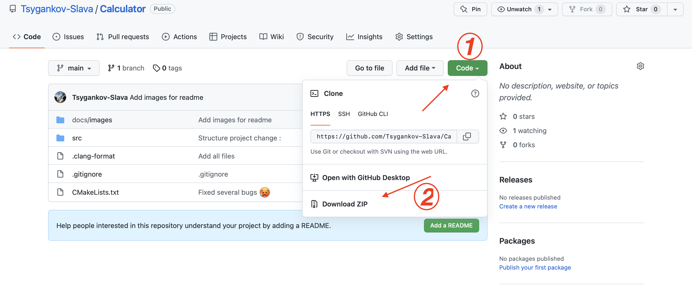

# Калькулятор на C/C++
# <a name="Table_of_contents"> Оглавление </a>
<ol>
  <a href="#Tools_used"> <li> Используемые инструменты для разработки </li> </a>
  <a href="#Download"> <li> Установка </li> </a>
  <a href="#Description"> <li> Описание </li> </a>
  <a href="#Example"> <li> Пример использования </li> </a>
</ol>

# <a name="Tools_used"> Используемые инструменты для разработки </a>
<ul>
  <li>ОС: macOS Big Sur</li>
  <li>Среда разработки: CLion от JetBrains</li>
  <li>Стандарт C++: 20</li>
  <li>Версия CMake: 3.20</li>
  <li>Версия GCC: 11.2.0</li>
</ul>
<p><a href="#Table_of_contents"> 🔝Оглавление </a></p>

# <a name="Download"> Установка </a>
1. Сначала скачаем проект из репозитория

<br>
2. Затем разархивируем его. 
<br>
3. Откроем терминал и перейдём в папку с проектом 
<br>

`(base) tv@Air-Tsygankov Desktop % cd Calculator-main` 
<br>
4. Создадим папку с именем `cmake-build-debug`, куда будем собирать проект и перейдём в неё
<br>
```
(base) tv@Air-Tsygankov Calculator-main % mkdir cmake-build-debug
(base) tv@Air-Tsygankov Calculator-main % cd cmake-build-debug 
```
5. Теперь следует выполнить команду `cmake`, куда передадим в аргумент файлы проекта, чтобы у нас создались необходимые файлы для самой сборки 

```
(base) tv@Air-Tsygankov cmake-build-debug % cmake ../
-- The CXX compiler identification is AppleClang 13.0.0.13000029
-- Detecting CXX compiler ABI info
-- Detecting CXX compiler ABI info - done
-- Check for working CXX compiler: /Library/Developer/CommandLineTools/usr/bin/c++ - skipped
-- Detecting CXX compile features
-- Detecting CXX compile features - done
-- Configuring done
-- Generating done
-- Build files have been written to: /Users/tv/Desktop/Calculator-main/cmake-build-debug
```
6. Выполним команду `make` для сборки проекта 

```
(base) tv@Air-Tsygankov cmake-build-debug % make
[ 11%] Building CXX object CMakeFiles/Calculator.dir/src/main.cpp.o
[ 22%] Building CXX object CMakeFiles/Calculator.dir/src/File/File.cpp.o
[ 33%] Building CXX object CMakeFiles/Calculator.dir/src/Variables/Variables.cpp.o
[ 44%] Building CXX object CMakeFiles/Calculator.dir/src/Token/Token.cpp.o
[ 55%] Building CXX object CMakeFiles/Calculator.dir/src/RPN/RPN.cpp.o
[ 66%] Building CXX object CMakeFiles/Calculator.dir/src/isDebug/isDebug.cpp.o
[ 77%] Building CXX object CMakeFiles/Calculator.dir/src/Debug/Debug.cpp.o
[ 88%] Building CXX object CMakeFiles/Calculator.dir/src/Containers/Vector/Vector.cpp.o
[100%] Linking CXX executable Calculator
[100%] Built target Calculator
```
7. Наш проект собрался и файл .exec/.exe лежит в папке `cmake-build-debug`, откуда в дальнейшем мы будем запускать наш проект (<a href="#Example">см. пункт "Пример использования"</a>)
<br>
<p><a href="#Table_of_contents"> 🔝Оглавление </a></p>

# <a name="Description"> Описание </a>
<ul><h3>Консольный калькулятор содержит:</h3>
  <ul>
    <li> 
      <a href="#Main_Operation"> Основные операции с числами {"+", "-", "*", "/"} </a> 
    </li>
    <li> 
      <a href="#Parentheses"> Поддержка скобок в выражениях </a> 
    </li>
    <li> 
      <a href="#Main_Function"> Основные функции {"sqrt", "log",  "sin", "cos", "exp", "real", "imag", "phase", "mag"} </a> 
    </li>
    <li> 
      <a href="#Constants"> Константы </a> 
    </li>
    <li> 
      <a href="#Variables"> Переменные </a> 
    </li>
  </ul>
</ul>
<p><a href="#Table_of_contents"> 🔝Оглавление </a></p>

# <a name="Main_Operation"> Основные операции с числами </a>
<ul>
  <li>
    <h3> Операция сложения </h3> 
    
  </li>
    <li>
    <h3> Операция вычитания </h3> 
    
  </li>
    <li>
    <h3> Операция умножения </h3> 
    
  </li>
    <li>
    <h3> Операция деления </h3> 
    
  </li>
</ul>
<p><a href="#Table_of_contents"> 🔝Оглавление </a></p>

# <a name="Parentheses"> Поддержка скобок в выражениях </a>
  
<p><a href="#Table_of_contents"> 🔝Оглавление </a></p>
  
# <a name="Main_Function"> Основные функции </a>
<ul>
  <li>
    <h3> Функция квадратного корня </h3> 
    
  </li>
  <li>
    <h3> Функция логарифма </h3> 
    
  </li>
  <li>
    <h3> Функция синуса </h3> 
    
  </li>
  <li>
    <h3> Функция косинуса </h3> 
    
  </li>
  <li>
    <h3> Функция экспоненты </h3> 
    
  </li>
  <li>
    <h3> Функция взятия дейтвительной части комплексного числа </h3> 
    
  </li>
  <li>
    <h3> Функция взятия мнимой части комплексного числа </h3> 
    
  </li>
  <li>
    <h3> Функция phase </h3> 
    
  </li>
  <li>
    <h3> Функция mag </h3> 
    
  </li>  
</ul>
<p><a href="#Table_of_contents"> 🔝Оглавление </a></p>

# <a name="Constants"> Константы </a>
`PI = 3.14159 (Число pi)`
<br>
`E = 2.71828 (Число Эйлера)`
<br>
<p><a href="#Table_of_contents"> 🔝Оглавление </a></p>

# <a name="Variables"> Переменные </a>
Переменные находятся в папке `/File` в файле `variables.txt`
Полный путь `../src/File/variables.txt`
Чтобы использовать переменные в калькуляторе, сначала проверьте, что они у Вас объявлены в файле `variables.txt`
<br>
❗Объявлять переменные можно в любом порядке
<br>
Пример файла `variables.txt` с некоторым количеством переменных

<br>
В данном примере объявлено 5 переменных `{x, y, z, ddx, xyz}`
<br>
После объявления переменных в файле `variables.txt` его следует сохранить, например сочетанием клавиш `Ctrl+s`, затем переменные можно спокойно использовать в математических выражениях
<br>
<p><a href="#Table_of_contents"> 🔝Оглавление </a></p>

# <a name="Example"> Пример использовния </a>
После успешной установки и сборки проекта запустим его. 
1. Для этого откроем терминал(консоль) и перейдём в папку с .exec/.exe файлом.
```
(base) tv@Air-Tsygankov Desktop % cd Calculator-main 
(base) tv@Air-Tsygankov Calculator-main % cd cmake-build-debug 
```
2. Запустим наш .exec/.exe файл. <br>
`(base) tv@Air-Tsygankov cmake-build-debug % ./Calculator `
3. Наш калькулятор запустился, если всё прошло успешно он попросит ввести выражение.
4. Попробуем ввести выражение `sin(x + y) * (xyz + ddx + z + y)`
<br>
Наши переменные в файле (их надо вводить отдельно [<a href="#Variables">см. пункт "Переменные"</a>]):

<br>
Выражение и ответ:

<br>
5. Чтобы завершить программу достаточно ввести комманду `exit`:

<p><a href="#Table_of_contents"> 🔝Оглавление </a></p>
